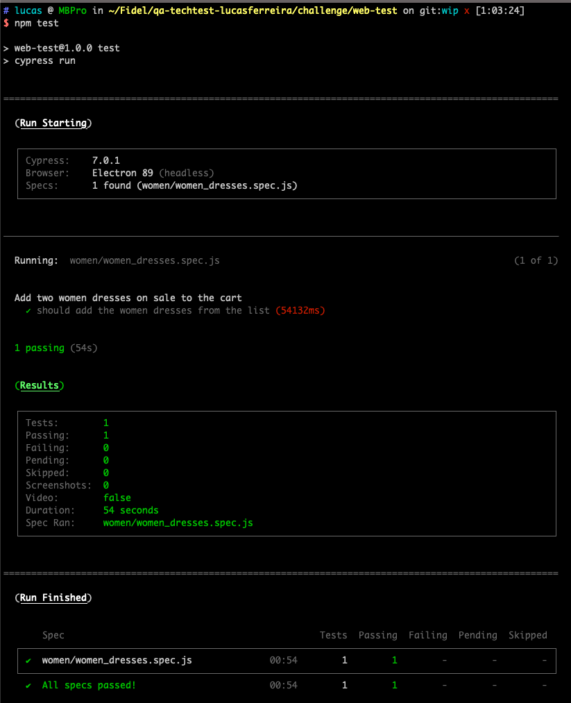
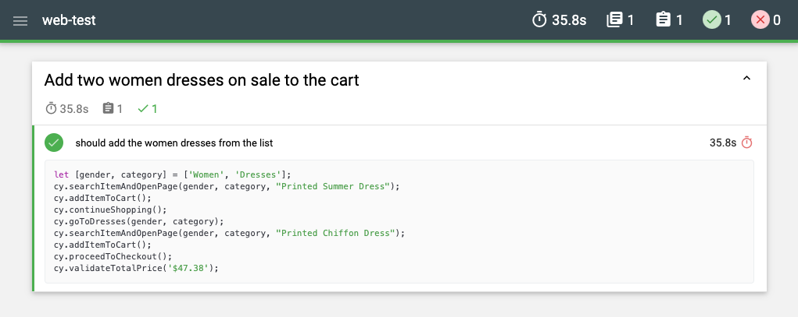
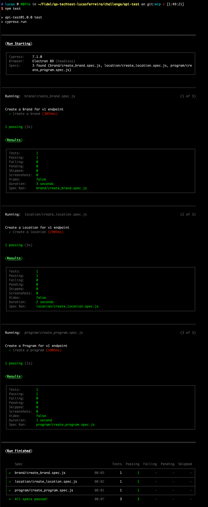
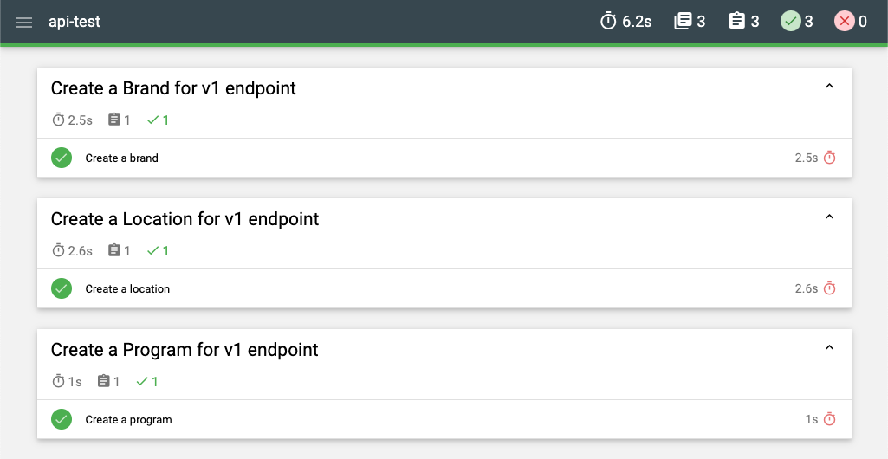

# Fidel QA Coding Challenge

[Challenge README](Challenge%20README.md)

## Repository Structure
---

This repository has being divided into two parts (part1 and part2) where **part1** refers to `web-test` and **part2** to `api-test`.

```bash
.
├── Challenge\ README.md
├── README.md
└── challenge
    ├── api-test   # <= Part2 is located here
    ├── resources
    └── web-test   # <= Part1 is located here
```

<br/><br/>

### Part1 - Web Test
---

[](https://dashboard.cypress.io/projects/yuub3m/runs)

For the first part of this challenge, an automation test for [Automation Practice](http://automationpractice.com/index.php) website was done to perform a search of two women dresses. These two dresses needed to be added to the cart and the total price must be validated in order to check if it is as expected.

```bash
.
├── cypress
│   ├── fixtures
│   ├── integration
│   │   └── women
│   │       └── women_dresses.spec.js   # <= Add two dresses to the cart
│   ├── plugins
│   │   └── index.js
│   ├── reports
│   │   ├── output.html   # <= Open the output.html file to view the test report results
│   │   ├── output.json
│   │   └── report_04152021_001550.json
│   └── support
│       ├── commands.js   # <= Here you can find the Cypress custom commands
│       └── index.js
├── cypress.json
├── package-lock.json
└── package.json
```

#### Testing Approach
---

There are 5 women dresses listed on this website. The approach was to add two dresses on sale. After searching for them, they were added to the cart and the shown total price (including taxes) was validated.

In `web-test/cypress/integration/women/women_dresses.spec.js` file there is one scenario that performs the search, the addition to the cart and finally proceeds to checkout where the total price can be validated.

For supporting too much code and reuse them when needed (not using page objects but Cypress Commands) the file `*/support/commands.js` contains all commands used in the `women_dresses.spec.js` file.

#### How to Run
---

In order to run the `web-test` project, please perform the following commands:

1. At first, install the project dependencies:

	```bash
	# If you are in the root folder use this command
	cd challenge/web-test && npm install

	# otherwise, if you are already in web-test...
	npm install
	```

2. Secondly, run the test:

	```bash
	npm test
	```

3. Finally, the results will be shown in the terminal output like this:

	

#### Report
---

The test report results for this project can be found in `web-test/cypress/reports/output.html`. It will look like this one:



<br/><br/>

### Part2 - API Test
---

[](https://dashboard.cypress.io/projects/194kbc/runs)

For the second part of this challenge, an automation test for [Fidel](https://api.fidel.uk/v1) API `/v1` was done to perform three steps: create a program, after that create a brand and then the program location.

```bash
.
├── cypress
│   ├── fixtures  # <= Here you can find the data used to perform the requests
│   │   ├── brand.json
│   │   ├── location.json
│   │   ├── program.json
│   │   └── program_id.json
│   ├── integration
│   │   ├── brand
│   │   │   └── create_brand.spec.js   # <= Create a brand
│   │   ├── location
│   │   │   └── create_location.spec.js   # <= Create a location
│   │   └── program
│   │       └── create_program.spec.js   # <= Create a program
│   ├── plugins
│   │   └── index.js   # <= Here you can find the task that generates the fake location data
│   ├── reports
│   │   ├── output.html   # <= Open the output.html file to view the test report results
│   │   ├── output.json
│   │   ├── report_04152021_001751.json
│   │   ├── report_04152021_001800.json
│   │   └── report_04152021_001807.json
│   └── support
│       ├── commands.js   # <= Here you can find the Cypress custom commands
│       └── index.js
├── cypress.json
├── package-lock.json
└── package.json
```

#### Testing Approach
---

The approach was to create three separate files and in each one to perform the corresponding action.

In `api-test/cypress/integration/program/create_program.spec.js` file there is one scenario that performs the creation of a program based on the program fixture file located in `api-test/cypress/fixtures/program.json` file.

In `api-test/cypress/integration/program/create_brand.spec.js` file there is one scenario that performs the creation of a brand based on the brand fixture file located in `api-test/cypress/fixtures/brand.json` file.

In `api-test/cypress/integration/program/create_location.spec.js` file there is one scenario that performs the creation of a location based on the location fixture file located in `api-test/cypress/fixtures/location.json` file. **Before the scenario is run, a program and a brand are created** to be associated. Even the location data is automatically created by the fakejs library.

For supporting too much code and reuse them when needed (not using page objects but Cypress Commands) the file `*/support/commands.js` contains all commands used in the `*.spec.js` files.

#### How to Run
---

In order to run the `api-test` project, please perform the following commands:

1. At first, install the project dependencies:

	```bash
	# If you are in the root folder use this command
	cd challenge/api-test && npm install

	# otherwise, if you are already in web-test...
	npm install
	```

2. Secondly, run the test:

	```bash
	npm test
	```

3. Finally, the results will be shown in the terminal output like this:

	

#### Report
---

The test report results for this project can be found in `api-test/cypress/reports/output.html`. It will look like this one:



---

>  Author: Lucas Ferreira \
Position: QA Engineer \
Delivery Date: <kbd>April 15th, 2021</kbd>
